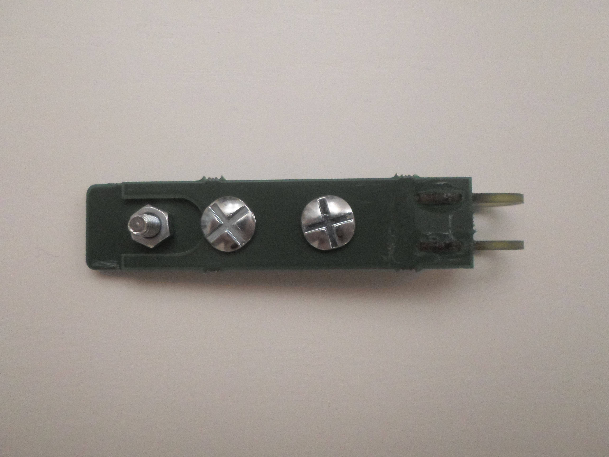
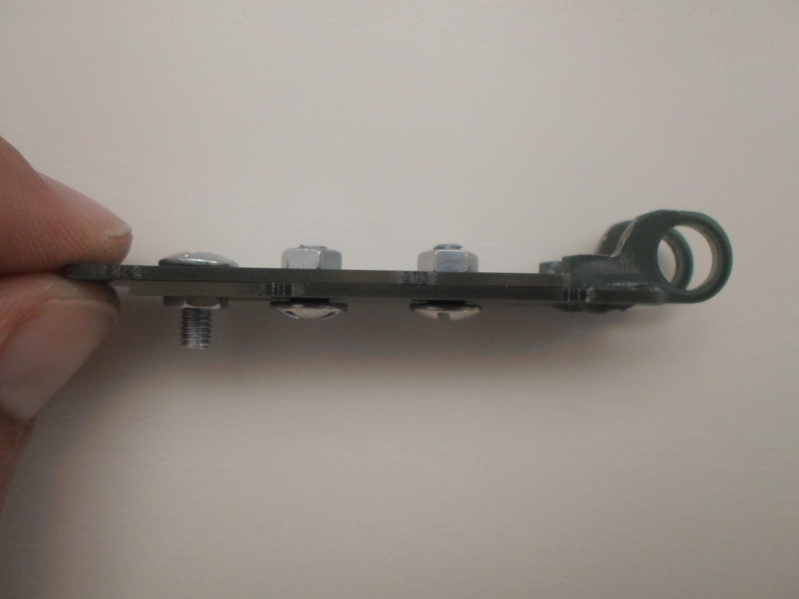

# Chip-8 Console

A Chip-8/SuperChip-8 console powered by a 8-bit PIC18 microcontroller.

## Specifications

* Microchip PIC18F27K42 8-bit microcontroller
* 64 MHz, giving a processing speed of up to 16 MIPS
* 8 KB of on-chip static RAM
* 128x64 pixels monochrome OLED display (Waveshare 2.42inch OLED Display Module)
* SD card interface to store games and files
* Powered by 2x AA batteries
* 8 keys usable with the Chip-8 interpreter, 1 menu key, 1 power-supply switch
* Monotone buzzer

## Dimensions

* Length : 175 mm
* Width : 95 mm
* Depth : 38 mm (including the adhesive feet)
* Weight : 1200 g (including the batteries and the SD card)

## Hardware

Display module :

Bare PCB :

Assembled PCB :

Assembled PCB with the display module screwed and connected :

## Casing

The casing is made of two laser-cut metal plates. They are both 4 mm thick and made of stainless 304 steel.  
The metal spacers are 20 mm high. The reference used here is `970200471` from Würth Elektronik.  

Casing plates :

Bottom plate with screws :

Bottom plate with screwed PCB :

Fully assembled console :

## Battery pack hatch

The hatch is made of PCB FR4. The hatch does not require to be as strong as the console casing and the FR4 is a good material to cut complex shapes into.

The hatch is cut as a PCB panel containing all the required parts :

The first assembly step is to glue the hinges :

The second step is to screw the sliding part, and also the bolt used to manipulate the hatch slider :

There is not enough room to use Nyloc nuts, so normal nuts are used and held in place with threadlocker.  
The tightening of these bolts allows the slider to slide with a little force, so the hatch can't open alone.

The strike is made of a piece of PCB coming from the panel edge that is inserted by force between the two metal plates :

Now the hatch can be assembled onto the console.  
Locked hatch :

Unlocked hatch :

Opened hatch :

## Photo gallery

The console boot logo :

Improved the PCB supports that were made of several nuts. The nuts did not had the same width, resulting in the PCB not being perfectly flat. The nuts have then been replaced by precise 10mm spacers :

Improved the top plate button holes (using holes of 9.6mm diameter) :

The various console menus (as of firmware `V1.1`) :

Playing some video games :  
*3D VIP'r Maze* :

*Ant* :

*Glitch Ghost* :

